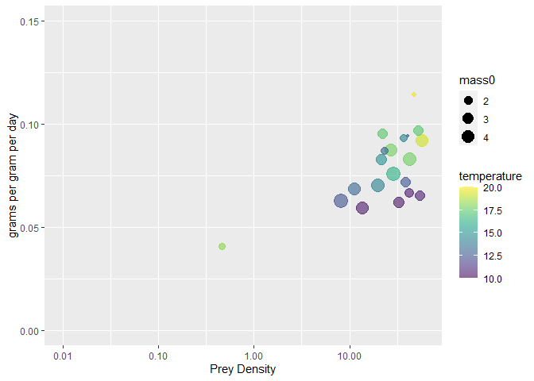

<!-- README.md is generated from README.Rmd. Please edit that file -->

# fisHeat

<!-- badges: start -->

<!-- badges: end -->

The goal of fisHeat is to predict the growth of juvenile salmon under
different temperature and prey availability scenarios.

## Installation

<!--
You can install the released version of fisHeat from [CRAN](https://CRAN.R-project.org) with:

``` r
install.packages("fisHeat")
```
-->

You can install the development version from
[GitHub](https://github.com/) with:

``` r
# install.packages("devtools")
devtools::install_github("coreyphillis/fisHeat")
```

## Example

Predict the new mass after 30 days for fish of given starting size and
different prey density and temperature.

``` r
library(fisHeat)

set.seed(12345)

df <- data.frame(mass0 = runif(20, 1, 5),
                 prey_density = runif(20, .1, 60),
                 temperature = runif(20, 10, 20),
                 days = rep(30,10))


df$newmass <- newmass_fxn(df, df$mass0, df$days)

# mass specific growth (grams per gram per day)
df$ggd <- df$newmass/df$mass0/df$days
```

``` r
head(df)
#>      mass0 prey_density temperature days   newmass        ggd
#> 1 3.883616     27.27831    17.82193   30 10.148469 0.08710499
#> 2 4.503093     19.67247    14.29199   30  9.493859 0.07027658
#> 3 4.043929     57.92838    19.27274   30 11.160041 0.09199007
#> 4 4.544498     42.47816    17.73243   30 11.335933 0.08314766
#> 5 2.825924     38.70810    12.59681   30  6.094889 0.07189258
#> 6 1.665487     23.45073    13.21225   30  4.338503 0.08683152
```

    #> Loading required package: viridisLite


